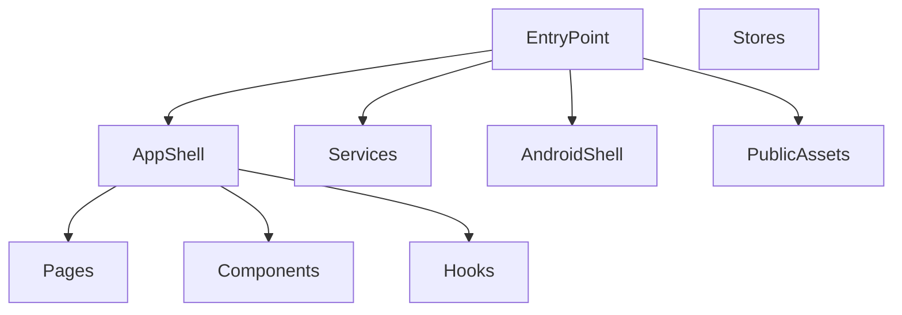

# Android-Studio

## Architecture / How it Works

```mermaid
flowchart TD
    EntryPoint --> AppShell
    EntryPoint --> Services
    EntryPoint --> AndroidShell
    EntryPoint --> PublicAssets
    AppShell --> Pages
    AppShell --> Components
    AppShell --> Hooks
    Stores
```
